<div align="center">

  <picture>
    <source media="(prefers-color-scheme: dark)" srcset="docs/modo_escuro_logo.png">
    <source media="(prefers-color-scheme: light)" srcset="docs/modo_claro_logo.png">
    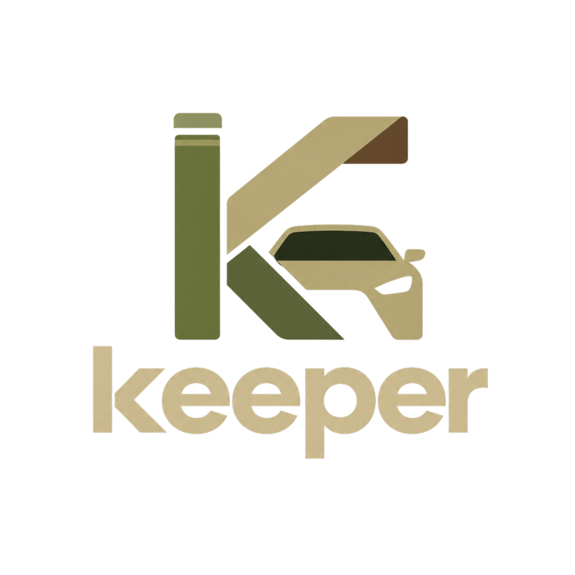
  </picture>

  <h1>KEEPER</h1>
  <h3>Sistema Inteligente de Controle de Acesso</h3>

  <p><b>Identificação &nbsp;•&nbsp; Validação &nbsp;•&nbsp; Autorização &nbsp;•&nbsp; Registro</b></p>

  <p>
    
    
    
    
  </p>
  <p>
    
    
    
    
  </p>

  <p>
    <a href="#sobre-o-projeto">Sobre</a> &nbsp;·&nbsp;
    <a href="#galeria-de-telas">Telas</a> &nbsp;·&nbsp;
    <a href="#como-funciona-o-fluxo-de-acesso">Fluxo</a> &nbsp;·&nbsp;
    <a href="#arquitetura">Arquitetura</a> &nbsp;·&nbsp;
    <a href="#segurança">Segurança</a> &nbsp;·&nbsp;
    <a href="#instalação-e-execução">Instalação</a> &nbsp;·&nbsp;
    <a href="#testes-e-validação">Testes</a> &nbsp;·&nbsp;
    <a href="#equipe">Equipe</a>
  </p>

</div>

---

## Sobre o projeto

O **KEEPER** é um sistema de controle de acesso de **pessoas e veículos**, desenvolvido pela equipe do curso **Técnico em Desenvolvimento de Sistemas** da **Escola SENAI “A. Jacob Lafer”**, em Santo André (SP), em 2026, como Situação de Aprendizagem Integradora da unidade curricular de **Desenvolvimento Mobile**.

Em um ambiente controlado, identificar o veículo, conferir a credencial do funcionário, verificar quem realmente está presente e registrar a movimentação costumam ser tarefas separadas. O KEEPER reúne tudo em um único fluxo: **placa → QR Code → rosto → confirmação do funcionário → registro**. Cada etapa só libera a seguinte, e **uma falha nunca é tratada como autorização**.

<div align="center">

| 🪪 Identifica | 🛡️ Valida | ✅ Autoriza | 🗂️ Registra |
|:---:|:---:|:---:|:---:|
| Funcionário e veículo | QR assinado e rosto com prova de vida | O próprio funcionário confirma no celular | Entrada, saída, histórico e auditoria |

</div>

> [!IMPORTANT]
> Nesta versão o KEEPER registra e administra a autorização **por software**. Ele **não aciona fisicamente** um portão ou uma cancela.

### Três aplicações, um único banco

| Aplicação | Arquivo | Para quem | O que faz |
|---|---|---|---|
| **Funcionário** | `employee.py` · `mobile.py` | Quem entra e sai | Credencial QR dinâmica, confirmação de acessos, veículos, histórico, perfil e rosto |
| **Máquina de portaria** | `machine.py` | Portaria (computador com câmera) | Lê a placa, o QR e o rosto, envia o pedido e acompanha a resposta |
| **Painel administrativo** | `admin.py` · `web_admin.py` | Administração | Cadastros, presença, histórico, relatórios, segurança e auditoria |

---

## Principais funcionalidades

<details open>
<summary><b>📱 Aplicativo do funcionário</b></summary>

<br>

- Login por usuário **ou** e-mail, com senha protegida por hash.
- **Cadastro próprio**, com veículo e referência facial.
- **Credencial digital em QR Code**, assinada e **renovada a cada 30 segundos**.
- Notificações e solicitações pendentes: o funcionário vê placa, sentido e portaria e **confirma ou recusa**.
- Cadastro, edição e ativação/inativação dos próprios veículos.
- Histórico de movimentações, edição de perfil e senha.
- Cadastro, recadastro e remoção da referência facial.
- “Esqueci minha senha” por código gerado pela administração.

</details>

<details open>
<summary><b>🚪 Máquina de portaria</b></summary>

<br>

- **Placa:** leitura por câmera/OCR, com digitação manual como alternativa; validação por REGEX (padrão antigo e Mercosul).
- **QR Code:** leitura pela câmera, conferência de assinatura, validade e vínculo com o dono da placa.
- **Rosto:** vários quadros consecutivos acima do limiar, **prova de vida** (virar a cabeça para o lado sorteado) e margem contra outros usuários.
- **Pedido:** envia a solicitação ao funcionário e aguarda a resposta (expira em 45 s, configurável).
- **Registro:** só grava a entrada/saída **depois** da confirmação.
- Recusa placa bloqueada, não cadastrada, de conta inativa, entrada de quem já está dentro e saída de quem não está.

</details>

<details open>
<summary><b>🖥️ Painel administrativo</b></summary>

<br>

- **Dashboard** com usuários, veículos, presentes (“dentro”), acessos do dia e solicitações pendentes.
- CRUD de usuários e veículos, com inativação, transferência e exclusão conforme as regras do sistema.
- **Histórico** filtrável, exportação em **CSV** e relatório em **PDF** (gráfico dos últimos 7 dias).
- Acesso manual de entrada e saída, gestão e cancelamento de solicitações.
- **Segurança:** bloqueio de placas, cadastro de visitantes com código e validade, geração de código de redefinição de senha (válido por 15 min).
- **Auditoria** das principais operações e **configurações** de câmera, OCR, limiar facial, nome da portaria e expiração.
- Backup do SQLite e atualização dos modelos faciais.

</details>

---

## Galeria de telas

### Do protótipo ao sistema

A interface nasceu de um protótipo navegável no **Figma**, que definiu a organização das telas, a navegação e o fluxo antes da programação, e serviu de referência para a construção em Flet.

<p align="center">
  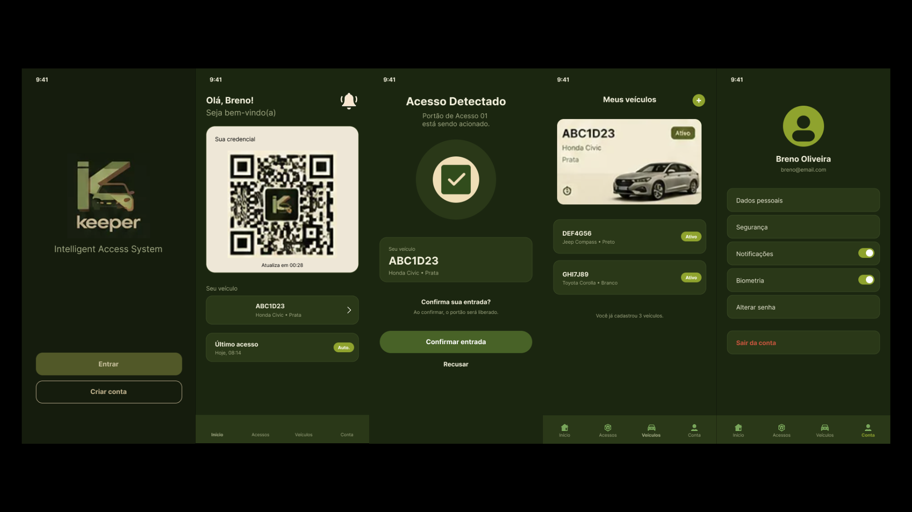
</p>
<p align="center"><sub><b>Figura 10</b> — Quadros do protótipo navegável elaborado no Figma.</sub></p>

<p align="center">
  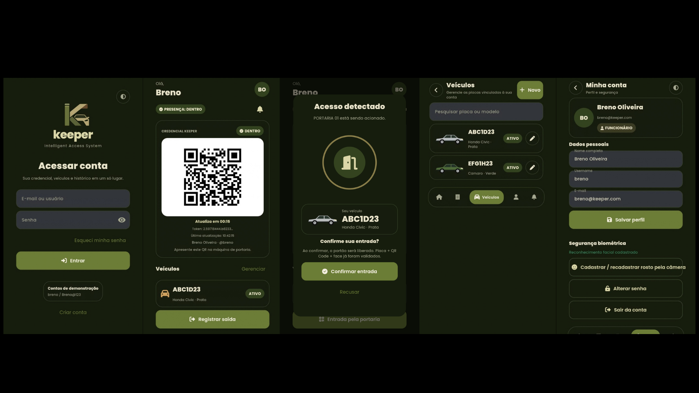
</p>
<p align="center"><sub><b>Figura 11</b> — Interface implementada, em execução na versão para celular.</sub></p>

### Funcionário

<p align="center">
  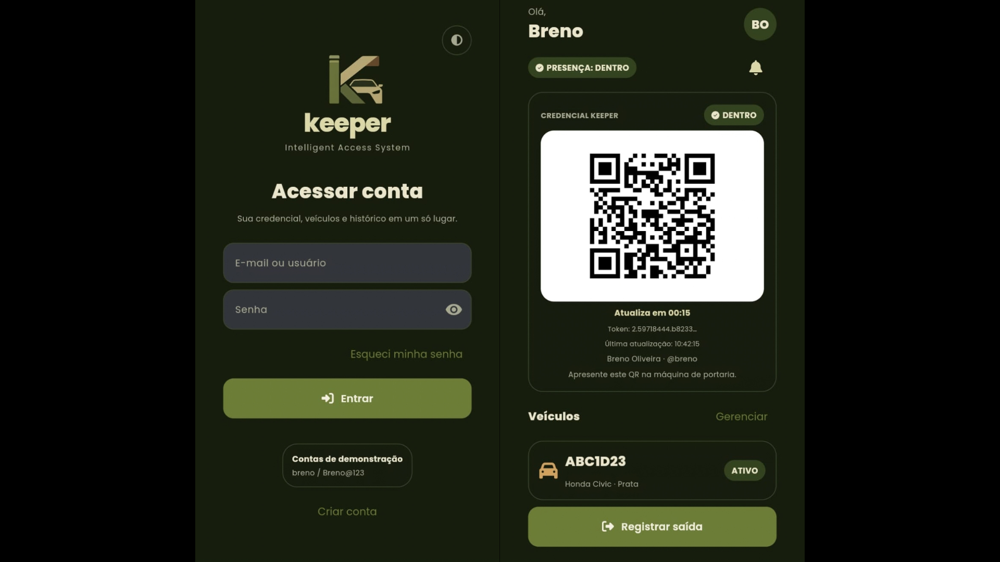
</p>
<p align="center"><sub><b>Figura 12</b> — Login, cadastro e credencial em QR Code do funcionário.</sub></p>

<p align="center">
  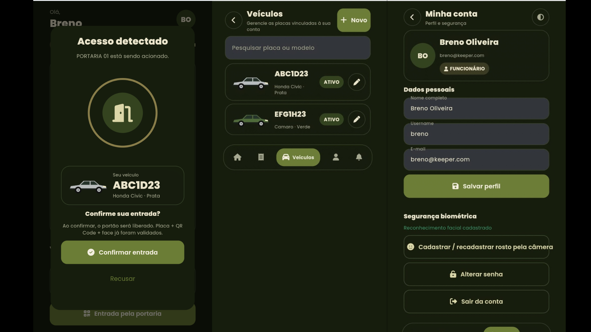
</p>
<p align="center"><sub><b>Figura 13</b> — Confirmação de solicitação, veículos, conta e histórico.</sub></p>

### Máquina de portaria

<p align="center">
  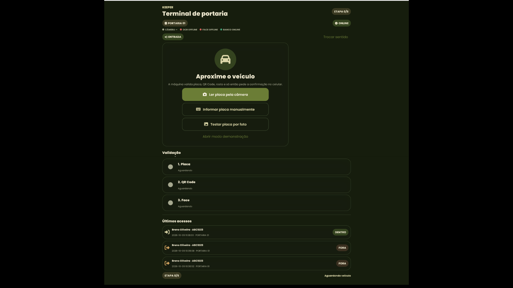
</p>
<p align="center"><sub><b>Figura 14</b> — Leitura de placa, QR Code, reconhecimento facial e espera da confirmação.</sub></p>

### Painel administrativo

<p align="center">
  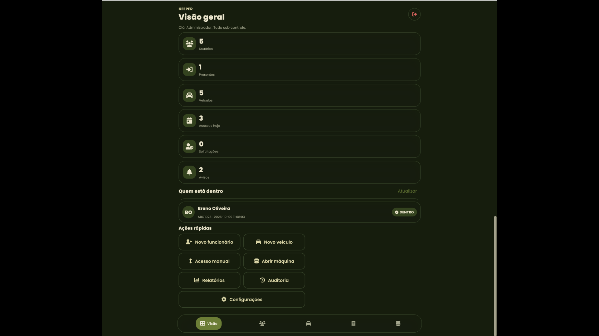
</p>
<p align="center"><sub><b>Figura 15</b> — Dashboard, usuários, veículos, histórico e configurações.</sub></p>

### Acesso remoto

<p align="center">
  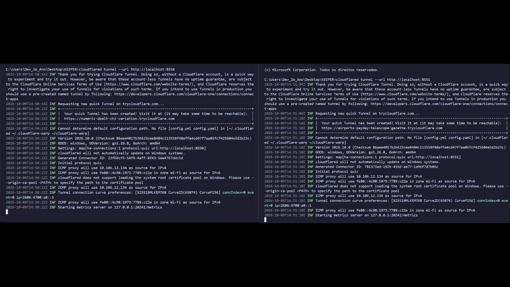
</p>
<p align="center"><sub><b>Figura 18</b> — Quick Tunnels criados pelo <code>cloudflared</code> em dois terminais.</sub></p>

---

## Como funciona o fluxo de acesso

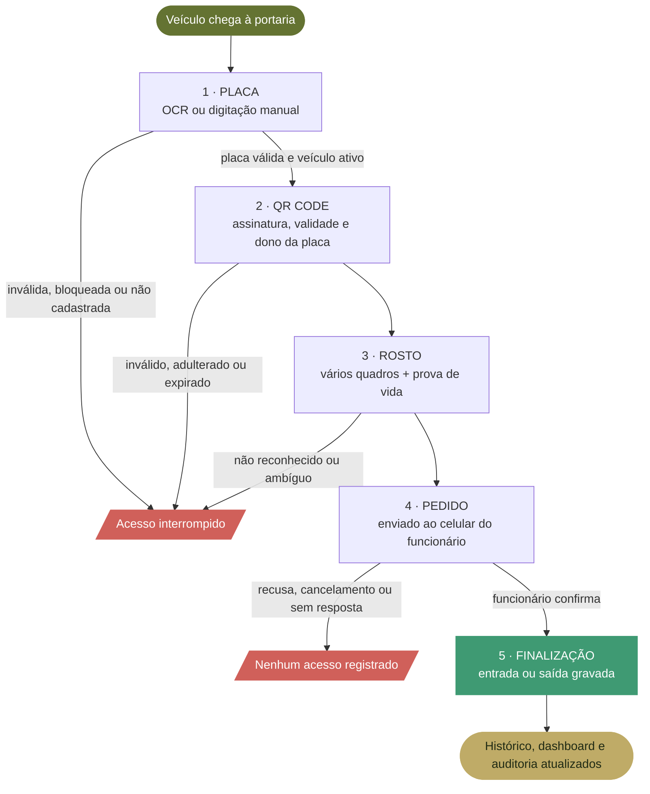

Cada solicitação percorre estes estados; **somente a confirmação do funcionário leva à finalização e ao registro**:

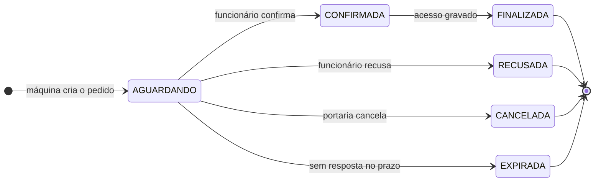

> Solicitações **recusadas**, **canceladas** ou **expiradas** não geram registro de acesso.

---

## Arquitetura

As três interfaces **não são sistemas isolados**: usam os mesmos componentes visuais (`ui.py`), as mesmas regras de dados (`db.py`) e os mesmos recursos de segurança (`security.py`), e gravam em um único `keeper.db`.

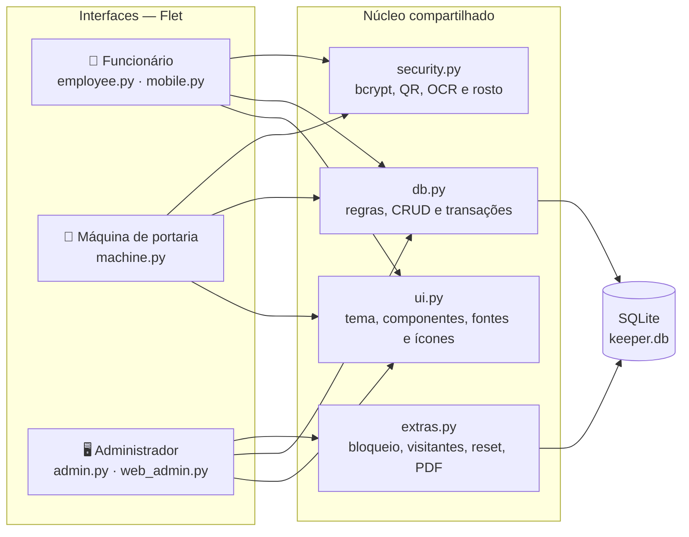

### Modelo de dados

O `keeper.db` tem **7 tabelas principais**, mais as criadas pelo módulo `extras.py` (`Placas_Bloqueadas`, `Visitantes` e `Reset_Senha`).

<details>
<summary><b>Ver diagrama entidade-relacionamento</b></summary>

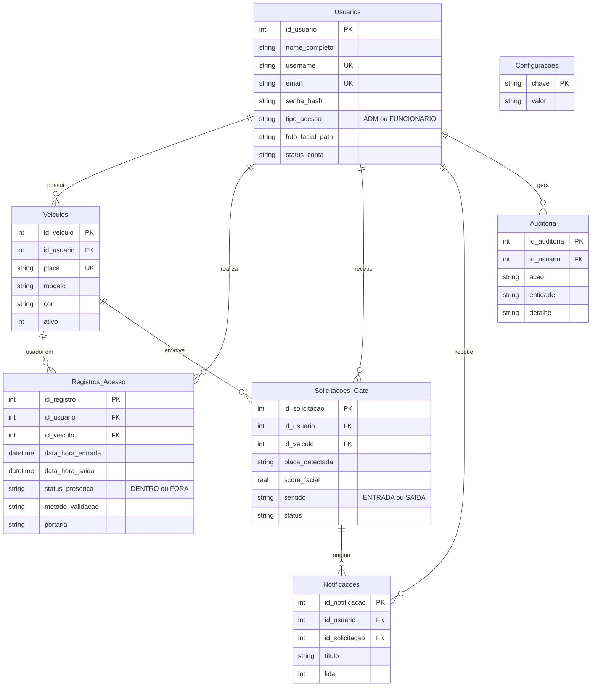

**Restrições:** `UNIQUE` em `username`, `email` e `placa`; `CHECK` em `tipo_acesso`, `status_presenca`, `sentido` e `status`; `ON DELETE CASCADE` em `Veiculos` e `Notificacoes`. Um veículo com histórico de acessos só pode ser **inativado**, nunca excluído.

</details>

---

## Segurança

| Camada | Como o KEEPER protege |
|---|---|
| **Senhas** | Guardadas com **hash bcrypt**; nunca em texto simples. |
| **Credencial** | QR Code **assinado (HMAC-SHA256)**, renovado a cada **30 s** e vinculado ao dono da placa. |
| **Validação de dados** | **4 expressões regulares** (e-mail, placa, usuário e senha forte) aplicadas antes de qualquer gravação. |
| **Reconhecimento facial** | Modelos **YuNet + SFace**: vários quadros consecutivos, **prova de vida** por giro da cabeça e checagem contra outros usuários. |
| **Limiar facial** | Padrão **0,45**, ajustável no painel, com **piso de 0,42** que o administrador não consegue reduzir. |
| **Duplicidade** | Restrições `UNIQUE` no banco, com mensagens claras (“Este nome de usuário já está em uso”). |
| **Redefinição de senha** | Código de 6 dígitos gerado pelo ADM, válido por **15 minutos**, com **5 tentativas** no máximo. |
| **Rastreabilidade** | Tabela de **auditoria** das principais operações. |
| **Falhas** | Qualquer falha de câmera, OCR, QR ou rosto mantém a máquina no passo atual: **falha nunca é autorização**. |

> [!WARNING]
> **Dados pessoais sensíveis.** A foto facial é dado pessoal sensível (LGPD, Lei nº 13.709/2018). O cadastro deve ocorrer **somente com consentimento**, e o acesso à pasta `data/faces/` precisa ser controlado. A comparação é feita no próprio sistema e **não** é a biometria nativa do sistema operacional.

---

## Identidade visual

O design system fica centralizado em `ui.py`: trocar de tema não exige reimplementar telas, e a escolha é gravada em `storage/theme.txt`.

<p align="center">
  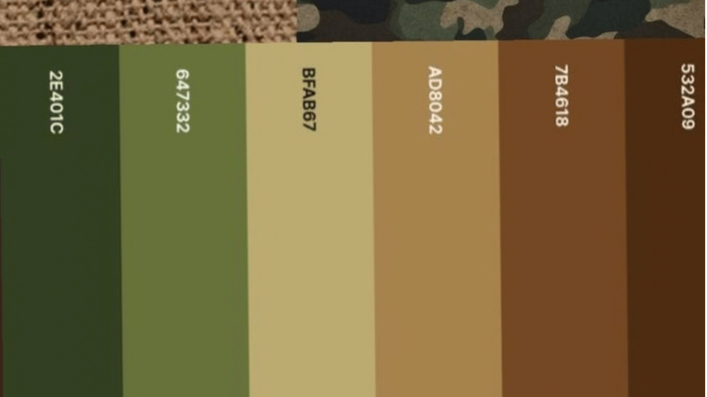
</p>

<p align="center">
  
  
  
  
  
  
</p>

| Elemento | Escolha |
|---|---|
| **Paleta** | Verde-oliva, bege e dourado, com verde/vermelho para sucesso e erro nos dois temas. |
| **Tipografia** | **Poppins** (Google Fonts), arquivos locais nos pesos Regular, Medium, SemiBold, Bold e ExtraBold. |
| **Ícones** | **Font Awesome 6 Free**, mapeados em `fa_icons.py`; complementam, sem substituir, os rótulos. |
| **Temas** | Claro e escuro, com troca imediata e preferência salva. |
| **Componentes** | Botões, cartões, campos, indicadores, barras e diálogos reutilizados em todas as telas. |

---

## Tecnologias utilizadas

| Tecnologia | Utilização |
|---|---|
| **Python 3.13** | Linguagem principal: interface, regras de negócio, dados e visão computacional. |
| **Flet 0.28.3** | Interfaces desktop e web (funcionário e administrador pelo navegador). |
| **SQLite** | Banco relacional local (`keeper.db`) com chaves, restrições e transações. |
| **bcrypt** | Hash e verificação de senhas. |
| **qrcode · Pillow** | Geração de QR Codes e processamento de imagens. |
| **OpenCV** | Câmera, leitura de QR Code e processamento facial. |
| **YuNet e SFace (ONNX)** | Detecção e comparação facial. |
| **pytesseract + Tesseract OCR** | Leitura do texto da placa. |
| **ReportLab** | Relatório de acessos em PDF. |
| **Cloudflare Tunnel** | Publicação temporária dos serviços web locais para demonstração remota. |
| **Git e GitHub** | Versionamento e colaboração. |

### Leitura da placa por OCR

A foto da placa é convertida para tons de cinza e ampliada três vezes; o sistema gera variantes (suavização, limiar de Otsu, limiar adaptativo e fechamento morfológico) e passa cada uma pelo Tesseract com lista de caracteres permitidos (A–Z e 0–9). O texto é normalizado, validado pela REGEX de placa, e prevalece o candidato mais repetido. Se nenhuma leitura for válida, a placa pode ser digitada.

---

## Estrutura do projeto

```text
KEEPER/
├── app.py                 # Central: abre as três visões
├── employee.py            # Interface do funcionário
├── machine.py             # Máquina de portaria e câmera
├── admin.py               # Painel administrativo
├── mobile.py              # Serviço web do funcionário (porta 8550)
├── web_admin.py           # Serviço web do administrador (porta 8551)
├── db.py                  # Banco de dados, regras e CRUD
├── security.py            # Autenticação, QR, OCR e reconhecimento facial
├── extras.py              # Bloqueio de placas, visitantes, reset de senha e PDF
├── ui.py                  # Design system: tema, componentes, fontes e ícones
├── fa_icons.py            # Mapa de ícones Font Awesome
├── smoke_test.py          # Testes automatizados de lógica
├── download_models.py     # Download dos modelos YuNet/SFace
├── requirements.txt       # Dependências Python
├── keeper.db              # Banco local (gerado na execução)
├── models/                # Modelos de visão computacional
├── assets/fonts/          # Poppins e Font Awesome
├── data/faces/            # Referências faciais locais (dado sensível)
├── exports/               # CSV e PDF exportados
├── storage/               # Preferências locais (tema)
├── docs/                  # Logos, paleta e imagens deste README
├── INSTALL_WINDOWS.cmd    # Prepara o ambiente
├── RUN_KEEPER.cmd         # Abre a central
├── RUN_DEMO.cmd           # Abre as três aplicações
├── RUN_SERVIDOR.cmd       # Sobe portaria + serviços web
├── RUN_LINK_PUBLICO.cmd   # Cria o link público (Quick Tunnel)
├── RESET_DEMO.cmd         # Recria o banco de demonstração
└── CHECK_KEEPER.cmd       # Executa os testes de lógica
```

---

## Instalação e execução

### Requisitos

- Windows 10/11 de 64 bits e **Python 3.13** de 64 bits.
- Dependências do `requirements.txt` (instaladas pelo script).
- **Tesseract OCR** instalado, para a leitura automática de placas.
- **Câmera**, para os recursos de placa, QR e rosto.
- Modelos **YuNet/SFace** (baixados pelo instalador ou por `download_models.py`).
- `cloudflared`, **apenas** se for publicar os serviços por Quick Tunnel.

### 1. Obtenha o projeto

```bash
git clone https://github.com/Breno-J-Oliveira/KEEPER.git
cd KEEPER
```

### 2. Prepare o ambiente (uma vez)

Dê dois cliques em **`INSTALL_WINDOWS.cmd`**. Ele cria o ambiente virtual, instala as dependências, tenta instalar o Tesseract pelo Winget e baixa os modelos faciais.

### 3. Execute

| Quero… | Faça |
|---|---|
| Abrir a tela central | `RUN_KEEPER.cmd` |
| Abrir as três aplicações para demonstrar | `RUN_DEMO.cmd` |
| Subir portaria e serviços web | `RUN_SERVIDOR.cmd` |
| Verificar se está tudo certo | `CHECK_KEEPER.cmd` |
| Recriar o banco de demonstração | `RESET_DEMO.cmd` |

Pelo terminal, com o ambiente virtual ativo:

```bash
.venv\Scripts\activate
python machine.py     # Máquina de portaria
python admin.py       # Painel administrativo
python employee.py    # Aplicativo do funcionário
```

### 4. Endereços dos serviços

| Serviço | Endereço | Porta |
|---|---|---:|
| Funcionário | `http://localhost:8550` | 8550 |
| Administrador | `http://localhost:8551` | 8551 |
| Portaria | Aplicativo local, no computador com a câmera | — |

Em outro dispositivo da mesma rede Wi-Fi, troque `localhost` pelo IP do computador servidor.

### Contas de demonstração

| Perfil | Usuário | Senha |
|---|---|---|
| Administrador | `admin` | `Admin@123` |
| Funcionário | `breno` | `Breno@123` |

> [!CAUTION]
> São credenciais **públicas de demonstração**. Troque a senha do administrador antes de expor o sistema fora do seu computador.

---

## Acesso remoto com Cloudflare Tunnel

Para demonstrar fora da rede local, o **Quick Tunnel** do Cloudflare publica um serviço local em um endereço temporário `https://...trycloudflare.com`, sem abrir portas no roteador.

```bash
cloudflared tunnel --url http://localhost:8550    # funcionário
cloudflared tunnel --url http://localhost:8551    # administrador
```

Ou dê dois cliques em `RUN_LINK_PUBLICO.cmd`.

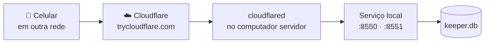

> [!NOTE]
> O sistema **não foi migrado para uma hospedagem independente**: processos e banco ficam no computador principal, que precisa permanecer ligado, conectado e com os serviços em execução. Os links temporários mudam quando os túneis são reiniciados. Em celulares, o cadastro do rosto deve ser feito no computador servidor, pois a câmera usada é a dele.

---

## Testes e validação

Os testes são de três tipos: **automatizados de lógica** (`smoke_test.py`, que cobre autenticação, QR, chaves estrangeiras, CRUD, entrada e saída, fluxo solicitação–confirmação–finalização e mensagens de duplicidade), **cenários de negócio** executados sobre as funções do sistema e **verificações com câmera e interface**.

<div align="center">

| ID | Cenário | Resultado esperado | Status |
|:---:|---|---|:---:|
| **CT01** | Login válido | Acesso permitido | ✅ Aprovado |
| **CT02** | Login inválido | Acesso recusado, com mensagem | ✅ Aprovado |
| **CT03** | Placa inválida | Validação apresentada | ✅ Aprovado |
| **CT04** | QR inválido ou expirado | Solicitação não autorizada | ✅ Aprovado |
| **CT05** | Recusa do funcionário | Acesso não autorizado | ✅ Aprovado |
| **CT06** | Confirmação de entrada | Registro de entrada | ✅ Aprovado |
| **CT07** | Saída autorizada | Registro de saída | ✅ Aprovado |
| **CT08** | Cadastro duplicado | Erro tratado | ✅ Aprovado |
| **CT09** | Solicitação sem resposta | Status `EXPIRADA` | ✅ Aprovado |
| **CT10** | Placa por câmera/foto (OCR) | Placa reconhecida | ✅ Aprovado |
| **CT11** | QR pela câmera | Leitura e validação | ✅ Aprovado |
| **CT12** | Reconhecimento facial com prova de vida | Rosto confirmado | ✅ Aprovado |

</div>

Para repetir os testes de lógica, execute `CHECK_KEEPER.cmd` (ou `python smoke_test.py`); o resultado esperado termina em **“Tudo certo”**.

---

## Limitações conhecidas

- O sistema depende do computador que mantém os serviços e o arquivo SQLite.
- Os Quick Tunnels são temporários e não substituem uma hospedagem permanente.
- OCR e reconhecimento facial variam conforme câmera, iluminação e qualidade da imagem, e **não são garantia de identificação**.
- O Tesseract é um componente externo e precisa estar instalado para a leitura automática de placas.
- O cadastro de **visitantes** (código e validade) existe no painel, mas a validação desses códigos **ainda não está integrada** ao fluxo da portaria.
- A versão **não aciona** portão ou cancela fisicamente.
- A chave usada para assinar o QR Code está **fixa no código** e deve ser externalizada antes de qualquer uso real.

## Próximas melhorias

- [ ] Externalizar segredos e parâmetros sensíveis para variáveis de ambiente.
- [ ] Integrar a validação de visitantes ao fluxo da portaria.
- [ ] Hospedagem persistente e armazenamento de dados adequado a um ambiente real.
- [ ] Captura facial pelo navegador, para cadastro direto pelo celular.
- [ ] Integração com hardware de portão/cancela, com mecanismos de segurança física.

---

## Metodologia

O trabalho seguiu a organização proposta pela Situação de Aprendizagem Integradora: **Product Backlog** com histórias de usuário e critérios de aceite, **Sprints**, **Daily Scrum**, **Sprint Review** e **Retrospective** (SCRUM), com versionamento em **Git/GitHub** e prototipagem no **Figma**.

🎨 **Protótipo navegável:** [abrir no Figma](https://www.figma.com/proto/hEcoAzWsyqeir4F2M2sd6O/Sem-t%C3%ADtulo?node-id=4-2708&p=f&t=9D96BB4Nd2LLfEur-1&scaling=min-zoom&content-scaling=fixed&page-id=0%3A1&starting-point-node-id=4%3A2708)

## Equipe

Projeto acadêmico desenvolvido no curso **Técnico em Desenvolvimento de Sistemas** da **Escola SENAI “A. Jacob Lafer”**, Santo André — SP, 2026.

| Integrante | Papel | Responsabilidade |
|---|---|---|
| **[Breno Oliveira](https://github.com/Breno-J-Oliveira)** | Dev | Desenvolvimento Back-End e Front-End |
| **Vinícius Vila Nova** | Product Owner | Gestão de requisitos e priorização do produto |
| **Gustavo Barreto** | Dev | Desenvolvimento Front-End e prototipagem de interfaces |
| **Mariana Felipe** | Scrum Master | Gestão ágil, acompanhamento de demandas e testes |
| **Felipe Bertaco** | Dev | Prototipagem de interfaces e identidade visual no Figma |
| **Nicolas Tukaze** | Dev | Apresentações e padronização visual |

**Orientadores:** Prof. Raul Lopes e Prof. Paulo Camargo.

---

<div align="center">
  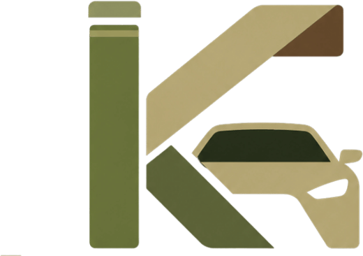
  <br>
  <sub><b>KEEPER</b> — Projeto acadêmico • Técnico em Desenvolvimento de Sistemas • SENAI “A. Jacob Lafer” • 2026</sub>
</div>
